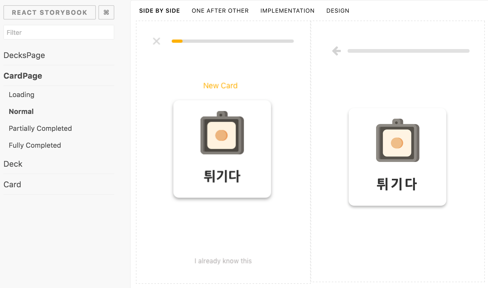

# Storybook Designer

React Storybook addon to show design mockups alongside your stories



## Usage

> FIXME: usage here

## Development

To modify the designer and see the changes in a local project, here is the
procedure:

1. Modify the code as needed
2. Link the module into an app or project where you want to use it

```
cd storybook-designer
npm link

cd /path/to/project
npm link @lab80/storybook-designer
npm install
```

Then every time you modify the code, in the `storybook-designer` directory
re-run `npm link` and refresh your browser.

To undo this when you are done:

```
cd storybook-designer
npm unlink

cd /path/to/project
npm unlink @lab80/storybook-designer
npm install
```
